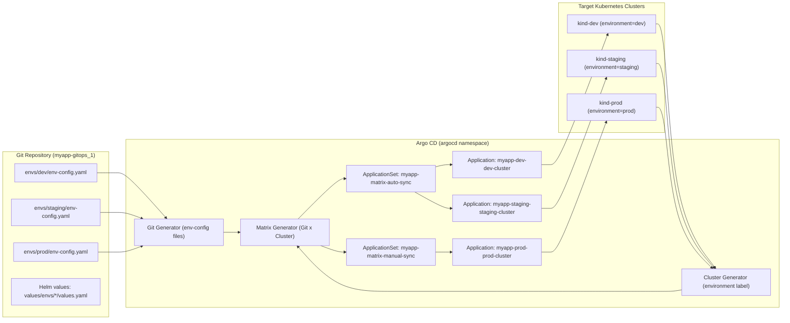
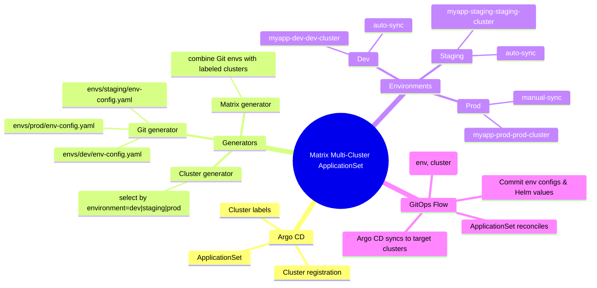

# Argo CD ApplicationSets – Matrix Generator for Multi-Cluster & Multi-Environment

This lab demonstrates how to use the Argo CD **ApplicationSet Matrix generator** to deploy one application (`myapp`) across **multiple clusters** (dev, staging, prod) and **multiple environments** (dev, staging, prod) from a single GitOps repository. [web:13][web:40]

The key idea is to combine:

- a **Git generator** that reads per‑environment configuration from `envs/*`, and
- a **Cluster generator** that selects target clusters by label (for example, `environment=prod`),  

then use the **matrix generator** to create an Application for each valid `(environment, cluster)` pair. [web:98][web:120]

---

## Learning Objectives

By completing this lab, you will:

- Understand **cluster registration and labeling** in Argo CD.
- Use the **Matrix generator** to combine Git + Cluster generators.
- Configure **auto‑sync** for dev/staging and **manual‑sync** for prod.
- Inspect generated `Application` objects and their sync/health status in Argo CD. [web:98][web:101]

---

## High-Level Architecture

The following component diagram shows how the pieces fit together.



---

## Conceptual Mindmap

This mindmap summarizes the main concepts in this lab.



---

## Prerequisites

Before running the matrix lab, you should have:

- A working Argo CD installation on the **dev** cluster (`kind-dev`).
- Three kind clusters: `kind-dev`, `kind-staging`, `kind-prod`.
- Argo CD CLI (`argocd`) available under `bin/argocd`.
- The `projects/`, `applicationsets/`, and `envs/` directories populated as in this repository. [web:116][web:42]

---

## Cluster Registration and Labeling

Argo CD must know **where to deploy** and **how to identify** each cluster as dev, staging, or prod. In this lab:

1. **Register clusters**

   ```bash
   make register-dev-staging-prod-clusters-in-argocd
   ```

   This uses `argocd cluster add` to register:

   - `kind-dev` as `dev-cluster`
   - `kind-staging` as `staging-cluster`
   - `kind-prod` as `prod-cluster` [web:108][web:111]

2. **Label cluster Secrets**

   ```bash
   make label-dev-cluster-for-myapp
   make label-staging-cluster-for-myapp
   make label-prod-cluster-for-myapp
   ```

   Each Argo CD cluster Secret in the `argocd` namespace is labeled with:

   - `environment=dev`
   - `environment=staging`
   - `environment=prod`  

   The **Cluster generator** uses these labels to select a subset of clusters (for example, only `environment=prod`) for a given ApplicationSet. [web:98][web:109][web:99]

---

## ApplicationSets Used in This Lab

There are two main ApplicationSets:

### 1. `myapp-matrix-auto-sync`

- **Purpose**: Deploy `myapp` to dev and staging, with **auto‑sync** enabled.
- **Generators**:
  - Git: `envs/dev/env-config.yaml`, `envs/staging/env-config.yaml`
  - Cluster: clusters labeled `environment={{ .environment }}` (dev or staging)
- **Matrix**: combines each environment config file with the matching cluster.
- **Resulting Applications**:
  - `myapp-dev-dev-cluster`
  - `myapp-staging-staging-cluster` [web:98][web:101]

Apply and inspect:

```bash
make k8s-apply-myapp-matrix-auto-sync-applicationset-to-cluster
make k8s-describe-myapp-matrix-auto-sync-applicationset
kubectl get applications -n argocd
```

### 2. `myapp-matrix-manual-sync`

- **Purpose**: Deploy `myapp` to prod with **manual‑sync** (no auto‑promotion).
- **Generators**:
  - Git: `envs/prod/env-config.yaml`
  - Cluster: clusters labeled `environment=prod`
- **Matrix**: produces the single prod Application.
- **Resulting Application**:
  - `myapp-prod-prod-cluster` [web:98][web:101]

Apply and inspect:

```bash
make k8s-apply-myapp-matrix-prod-manual-sync-applicationset-to-cluster
make k8s-describe-myapp-matrix-manual-sync-applicationset
kubectl get applications -n argocd
```

---

## Syncing and Health Checks

Once the ApplicationSets have reconciled and generated Applications, you can sync them using the Argo CD CLI or the Makefile targets.

### Sync dev and staging (auto-sync environments)

```bash
make argocd-sync-and-wait-myapp-dev-staging
```

This target:

- discovers Applications with names matching `myapp-(dev|staging)-*`,
- runs `argocd app sync` on them,
- waits for `--sync --health` to become successful. [web:90][web:93]

### Sync prod (manual promotion)

```bash
make argocd-sync-and-wait-myapp-prod
```

This target:

- discovers the prod Application (for example, `myapp-prod-prod-cluster`),
- runs `argocd app sync`,
- waits for the Application to become Synced and Healthy.  

This models a **manual promotion** step from staging to prod, with prod staying under explicit control. [web:126][web:127]

---

## End-to-End Lab Flow

An example sequence to run the full matrix lab:

```bash
# 1. Install and expose Argo CD on dev cluster
make install-argocd-on-kind-dev
make k8s-argocd-expose-argocd-server-to-localaccess

# 2. Login via Argo CD CLI
make argocd-login-argocd-server-via-cli

# 3. Register and label clusters
make register-dev-staging-prod-clusters-in-argocd
make label-dev-cluster-for-myapp
make label-staging-cluster-for-myapp
make label-prod-cluster-for-myapp

# 4. Apply AppProject for the myapp team
make k8s-apply-myapp-team-project

# 5. Apply matrix ApplicationSets (auto-sync + manual-sync)
make k8s-apply-myapp-matrix-auto-sync-applicationset-to-cluster
make k8s-apply-myapp-matrix-prod-manual-sync-applicationset-to-cluster

# 6. Wait for Applications to be generated
kubectl get applications -n argocd

# 7. Sync dev/staging and then prod
make argocd-sync-and-wait-myapp-dev-staging
make argocd-sync-and-wait-myapp-prod
```

---

## Cleaning Up

To clean up Applications and namespaces created by the matrix lab:

```bash
make argocd-delete-all-myapp-apps-created-using-matrix-generator
make reset-myapp-envs-applications-and-namespaces
```

These targets delete:

- matrix‑generated Applications (`myapp-*`),
- environment namespaces (`myapp-dev`, `myapp-staging`, `myapp-prod`) if they exist.  

Use these before re‑running the lab to avoid stale resources. [web:42][web:128]

---
