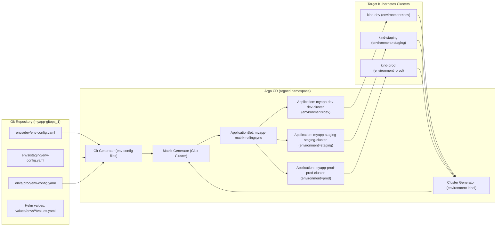

# Argo CD ApplicationSets – Matrix Generator with RollingSync (Progressive Delivery)

This lab extends the **Matrix multi-cluster ApplicationSet** example by adding **Progressive Syncs (RollingSync)** to control how changes roll out across environments and clusters. Instead of syncing dev, staging, and prod all at once, RollingSync syncs them in **ordered steps**: dev → staging → prod, with health checks gating progression. [web:129][web:133]

---

## What This Lab Demonstrates

- Using **Matrix generator** (Git + Cluster) to create Applications for dev, staging, and prod across multiple clusters.
- Enabling **Progressive Syncs** on the ApplicationSet controller.
- Configuring **RollingSync strategy** to roll out changes first to dev, then staging, then prod.
- Verifying fleet rollout behavior and blast-radius control (broken changes stop at dev/staging). [web:129][web:130][web:139]

---

## High-Level Architecture

This diagram shows the components involved in RollingSync over a matrix of environments and clusters.



---

## RollingSync Strategy Overview

RollingSync is a **progressive rollout strategy** for ApplicationSets. Instead of “sync all children at once,” you define **steps** that select Applications by label and limit how many are synced per step via `maxUpdate`. [web:129][web:133][web:139]

In this lab:

- Step 1: sync Applications labeled `environment=dev`.
- Step 2: sync Applications labeled `environment=staging` (with `maxUpdate: "1"`).
- Step 3: sync Applications labeled `environment=prod` (with `maxUpdate: "1"`).

If any Application in a step fails health checks, the rollout halts and later steps are not executed, preventing bad changes from reaching staging or prod. [web:129][web:133]

---

## Prerequisites

Before running the RollingSync lab:

- Argo CD installed on the **dev** cluster (`kind-dev`).
- Three kind clusters: `kind-dev`, `kind-staging`, `kind-prod`.
- Argo CD CLI (`argocd`) available as `bin/argocd`.
- Matrix lab files already present (projects, envs, applicationsets).
- Cluster secrets labeled with `environment=dev|staging|prod`. [web:132][web:133]

---

## Enabling Progressive Syncs (RollingSync)

RollingSync requires a feature flag on the ApplicationSet controller. [web:129][web:140]

1. Edit the ConfigMap:

   ```bash
   kubectl edit cm -n argocd argocd-cmd-params-cm
   ```

2. Ensure the following is present under `data`:

   ```yaml
   applicationsetcontroller.enable.progressive.syncs: "true"
   ```

3. Restart the controller:

   ```bash
   kubectl rollout restart deployment argocd-applicationset-controller -n argocd
   ```

This enables Progressive Syncs (RollingSync) for your ApplicationSets. [web:129][web:140]

---

## RollingSync Matrix ApplicationSet YAML

The main ApplicationSet for this lab is `applicationsets/myapp-matrix-rollingsync.yaml`. It combines:

- **Matrix generator**: Git + Cluster.
- **RollingSync strategy**: dev → staging → prod, gated by labels. [web:129][web:133]

Key sections (simplified):

```yaml
apiVersion: argoproj.io/v1alpha1
kind: ApplicationSet
metadata:
  name: myapp-matrix-rollingsync
  namespace: argocd
spec:
  goTemplate: true

  strategy:
    type: RollingSync
    rollingSync:
      steps:
        - matchExpressions:
            - key: environment
              operator: In
              values: ["dev"]
        - matchExpressions:
            - key: environment
              operator: In
              values: ["staging"]
          maxUpdate: "1"
        - matchExpressions:
            - key: environment
              operator: In
              values: ["prod"]
          maxUpdate: "1"

  generators:
    - matrix:
        generators:
          - git:
              repoURL: https://github.com/gMpHSpLB/myapp-gitops_1.git
              revision: main
              files:
                - path: envs/dev/env-config.yaml
                - path: envs/staging/env-config.yaml
                - path: envs/prod/env-config.yaml
          - clusters:
              selector:
                matchLabels:
                  environment: "{{ .environment }}"

  template:
    metadata:
      name: "myapp-{{ .environment }}-{{ .name }}"
      labels:
        environment: "{{ .environment }}"
        cluster: "{{ .name }}"
        requireManualPromotion: "{{ .requireManualPromotion }}"
    spec:
      project: myapp-team
      sources:
        - repoURL: ghcr.io/gmphsplb/helm-lab
          chart: myapp
          targetRevision: "{{ .chartVersion }}"
          helm:
            valueFiles:
              - "$values/envs/{{ .environment }}/values.yaml"
        - repoURL: https://github.com/gMpHSpLB/myapp-gitops_1.git
          targetRevision: "{{ .revision }}"
          ref: values
      destination:
        server: "{{ .server }}"
        namespace: "{{ .namespace }}"
      syncPolicy:
        automated:
          prune: true
          selfHeal: true
        syncOptions:
          - CreateNamespace=true
          - Validate=true
          - ApplyOutOfSyncOnly=true
          - ServerSideApply=true
```

Important details:

- **Labels on Applications**: `environment` is used by RollingSync steps to select which Applications belong to each phase. [web:129][web:133]
- **Automated sync**: Progressive Syncs control the order in which auto-sync runs; health gates control progression. [web:129][web:141]

---

## One-Button Lab Target

In the main `Makefile`, this lab is started by:

```bash
make create-argocd-myapp-kind-matrix-rollingsync-progressive-delivery-and-status-check
```

This target performs:

1. Optional cleanup of existing myapp Applications and namespaces.
2. Creation of `kind-dev`, `kind-staging`, `kind-prod`.
3. Argo CD install on `kind-dev` and API exposure.
4. Progressive Syncs flag setup (ConfigMap + controller restart).
5. Application of `myapp-team` AppProject.
6. Cluster registration for dev/staging/prod.
7. Labeling cluster secrets with `environment=dev|staging|prod`.
8. Applying the `myapp-matrix-rollingsync` ApplicationSet.
9. Forcing a refresh and printing RollingSync status and fleet health.

---

## Verification Targets

To inspect rollout and fleet health, use the RollingSync Makefile targets.

### Verify fleet under RollingSync

```bash
make -f Makefile_Setup_ArgoCD_ApplicationSets_Using_Rollingsync_Progessive_Delivery_Matrix_Multi_Clusters_Multi_Envs_Generator \
  verify-myapp-fleet-under-rollingsync
```

This prints:

- the full YAML of `myapp-matrix-rollingsync` (including `status` and `resources`), and
- all `myapp-*` Applications grouped by `environment=dev|staging|prod`, including sync and health status.  

Check that dev Applications become **Synced/Healthy** before staging, and staging before prod. [web:129][web:133][web:139]

### Watch fleet rollout

```bash
make -f Makefile_Setup_ArgoCD_ApplicationSets_Using_Rollingsync_Progessive_Delivery_Matrix_Multi_Clusters_Multi_Envs_Generator \
  watch-myapp-fleet-under-rollingsync
```

This continuously runs:

```bash
argocd app list -l environment -o wide | grep myapp-
```

so you can visually see dev → staging → prod rollout over time. [web:133][web:139][web:141]

---

## Testing Blast-Radius Control

To see RollingSync stop a bad change before it reaches prod:

1. Break the dev configuration (for example, invalid image tag in `values/envs/dev/values.yaml`).
2. Commit and push the change.
3. Annotate the ApplicationSet to force a refresh:

   ```bash
   kubectl annotate applicationset myapp-matrix-rollingsync -n argocd \
     argocd.argoproj.io/refresh=hard --overwrite
   ```

4. Watch dev, staging, and prod in the Argo CD UI or via:

   ```bash
   make verify-myapp-fleet-under-rollingsync
   ```

You should see dev fail health checks and the rollout **not proceed** to staging or prod, demonstrating environment-based blast-radius control. 
---
